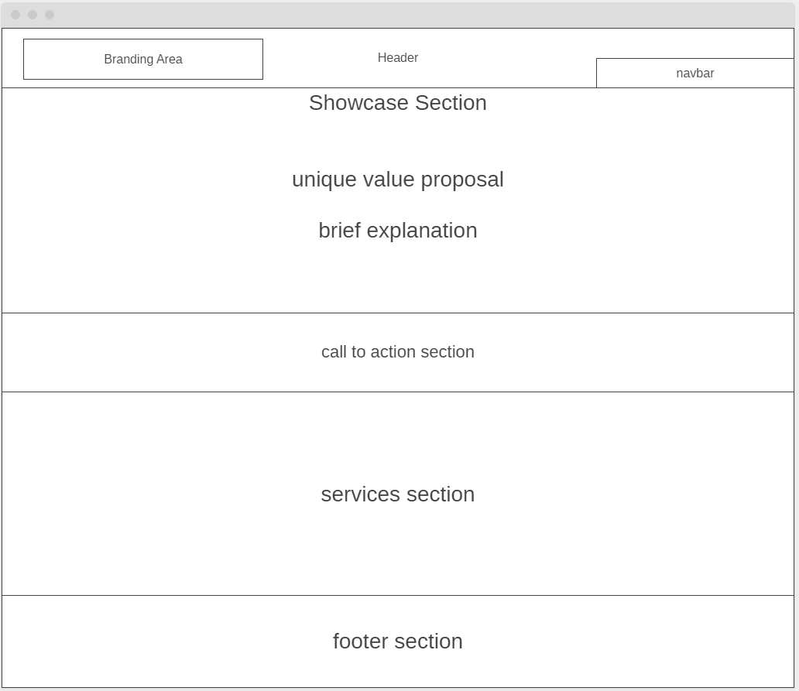

# Development Strategy

> `Acme-Web-Design`

This website will be developed for the Acme Web Design Company as a company homepage. 
write a short description of your project:
- who would want to use it?
- why would they want to use it?

## Wireframe

<!-- include a wireframe for your project in this repository, and display it here -->
<!-- wireframe.cc is a good site for getting started with wireframes -->

## 0. Set-Up

__A User can see my initial repository and live demo__

### Repo

- Generate from Template
- Write initial, basic README
- Turn on GitHub Pages

## 1. User Story: Header

__As a user I want to see company logo and a navigation menu at the top of the page.__

### Repo

1. This user story was developed on a branch named `1-header`.
2. It was merged to `master` when the feature was finished.

### HTML

- A header element with company logo.  
- A nav element which contains a list of navigation menu items.

### CSS

- Layout styling for the header.
- Setting up background color.
- Positioning company logo and navigation items.
- Setting up text size and color.

## 2. User Story: Homepage Showcase Section

__As a user I want to see a section on homepage which contains a title and a short explanation.__

### Repo

1. This user story developed on a branch named `2-homepage-showcase-section`.
2. It was merged to master when the feature was finished.

### HTML

- A section element.
- A div element containing title and description paragraph.
- An h1 element with page title.
- A p element with brief info.

### CSS

- Layout styling for the section element.
- Layout styling fot the container div.
- Setting up background image.
- Text styling for h1 and p elements.

## 3. User Story: Homepage Newsletter Section

__As a user I want to see a form to be able to subscribe for the company newsletter.__

### Repo

1. This user story developed on a branch named `3-homepage-newsletter-section`.
2. It was merged to master when the feature was finished.

### HTML

- A section element.
- A div element containing CTA message and newsletter form.
- An h1 element for CTA.
- A form element with email input and button.

### CSS

- Layout styling for section element.
- Layout styling for container div.
- Setting up background color.
- Text styling for h1.
- Styling of form elements.

## 4. User Story: Homepage Boxes Section

__As a user I want to see services provided by the company and short description for each one on the homepage.__

### Repo

1. This user story developed on a branch named `4-homepage-boxes-section`.
2. It was merged to master when the feature was finished.

### HTML

- A section element.
- A container div to keep all boxes.
- Three divs with class of box to contain images, headings and descriptions of each service.
- img, h1 and p tags for each service.

### CSS

- Layout styling for section element.
- Layout styling for divs with class of box.
- Styling for images.

## 5. User Story: Footer

__As a user I want to see footer with copyright information.__

### Repo

1. This user story developed on a branch named `5-footer`.
2. It was merged to master when the feature was finished.

### HTML

- A footer element.
- A p tag with basic copyright info.

### CSS

- Layout styling for footer element.
- Setting up background color and text styling.

## 6. User Story: About Page

__As a user I want to see an about page in which I can find information about the company__

### Repo

1. This user story developed on a branch named `6-about-page`.
2. It was merged to master when the feature was finished.

### HTML

- A section element and a container div for the main content.
- An article element containing an h1 tag and p tag.
- An aside element containing an h1 and p tag for additional info.

### CSS

- Layout styling for section element.
- Layout styling for article and aside elements.

## 7. User Story: Services Page, Services and Prices

__As a user I want to see a list of services and prices.__

### Repo

1. This user story developed on a branch named `7-services-page-price-list`.
2. It was merged to master when the feature was finished.

### HTML

- A section element and a container div.
- An article element containing an ul tag and one li tag for each service.
- h1 tags for each service name and p tags for description and pricing info.

### CSS

- Layout styling for section element.
- Styling for price list items.

## 8. User Story: Services Page Quote Form

__As a user I want to see a form on services page so I can ask for a quote.__

### Repo

1. This user story developed on a branch named `8-services-page-quote-form`.
2. It was merged to master when the feature was finished.

### HTML

- An aside element to contain quote form.
- A form tag containing input areas for name and email and a text area for the explanation of the services needed.

### CSS

- Layout styling for aside and form elements.
- Styling for input tags.

## 9. User Story: Media Queries

__As a user I want to see a responsive website that displays well on different devices and screen sizes__

### Repo

1. This user story developed on a branch named `9-media-queries`.
2. It was merged to master when the feature was finished.

### CSS

- Adding media queries for responsive display.

## 10. User Story: Final Touches and Fixes

__Final touches and bug fixes__

### Repo

1. This user story developed on a branch named `10-final-touches`.
2. It was merged to master when the feature was finished.

----

## Finishing Touches

- Write final, complete README:
  - [makeareadme.com](https://www.makeareadme.com/)
  - [bulldogjob](https://bulldogjob.com/news/449-how-to-write-a-good-readme-for-your-github-project)
  - [meakaakka](https://medium.com/@meakaakka/a-beginners-guide-to-writing-a-kickass-readme-7ac01da88ab3)
- Validate code to check for any last mistakes
